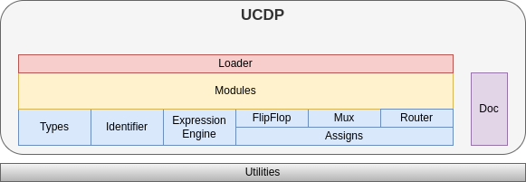

Architecture
============

This section introduces the architecture of ``ucdp``.

.. contents::
  :local:

Overview
~~~~~~~~

The central idea of `ucdp` is to describe the chip `Modules`_ and their:

* `Identifier`_ (:any:`Port`, :any:`Signal`, :any:`Parameter`) including their `Types`_
* Logical Expressions in Python which get translated to HDL by the `Expression Engine`_.
* Connections (`Assigns`_) of signals and ports, `Flip-Flop`_ and `Multiplexer`_. A `Router`_ eases connection creation.
* Module Hierarchy (`Modules`) - other submodules
* and document (`Documentation`_) well!

The `Loader`_ searches a specific top module and creates the entire datamodel.

Types
~~~~~

Identifier
~~~~~~~~~~

Expression Engine
~~~~~~~~~~~~~~~~~

Assigns
~~~~~~~

Flip-Flop
---------

Multiplexer
-----------

Router
------

Modules
~~~~~~~

Documentation
~~~~~~~~~~~~~

All :any:`Identifier` (:any:`Port`, :any:`Signal`, :any:`Parameter`) and module instances
should be well documented. The documentation container :any:`Doc` stores the triple of
``title``, ``descr`` and ``comment``.

Loader
~~~~~~

Utilties
~~~~~~~~

This section lists all external libraries and their usage

.. list-table:: Our Dependencies
   :widths: 25 75
   :header-rows: 1

   * - Name
     - Usage
   * - :any:`attrs`
     - | **Datamodel.**
       | All Data Classes base on :any:`attrs.define`.
       | We only use what :any:`ucdp.attrs` serves us, to handle :any:`attrs` API changes gracefully.
   * - ``mementos``
     - | **Caching.**
       | Read-Only objects with the same idenitdy (arguments) are just created once.
       | We save memory, memory and memory. And we gain speed and speed.
   * - `tabulate <https://pypi.org/project/tabulate/>`_
     - | **Table Formatting.**
       | We need to present a lot of data.
       | `tabulate <https://pypi.org/project/tabulate/>`_ creates nice tables in many formats.
   * - :any:`aligntext`
     - | **Code Formatting.**
       | Readable program code should be aligned.
       | During Code Generation :any:`aligntext` handles that for us.
   * - :any:`humannum`
     - | **Number Formatting.**
       | Designer like binary related numbers to be presented in :any:`humannum.bin_`,
       | :any:`humannum.hex_` or :any:`humannum.bytes` notation.
       | :any:`humannum` extends python builtin numbers by that feature.
   * - :any:`outputfile`
     - | **Timestamp Preserving File Writing.**
       | File timestamps are key when it comes to build systems.
       | :any:`outputfile.open_` preserves the timestamp of the generated file
       | on identical file content.
   * - :any:`makolator`
     - | **Mako Templates Extended.**
       | Code generation is much easier with a template engine.
       | `mako <https://www.makotemplates.org/>`_ is fast, allows python code in templates and supports inheritance.
       | :any:`makolator` uses :any:`outputfile` and simplifies the use of `mako <https://www.makotemplates.org/>`_.
   * - :any:`uniquer`
     - | **Utility to remove duplicates.**
       | Remove duplicates from iterables.
   * - `case-converter <https://pypi.org/project/case-converter/>`_
     - | **Name Converter.**
       | Convert names between different name schemes:
       | ``PascalCase``, ``camelCase``, ``snake_case``,
   * - :any:`icdutil`
     - | **IC Design Utilties.**
       | Helper for binary related chip infrastructure.
   * - :any:`matchor`
     - | **String Pattern Matching.**
